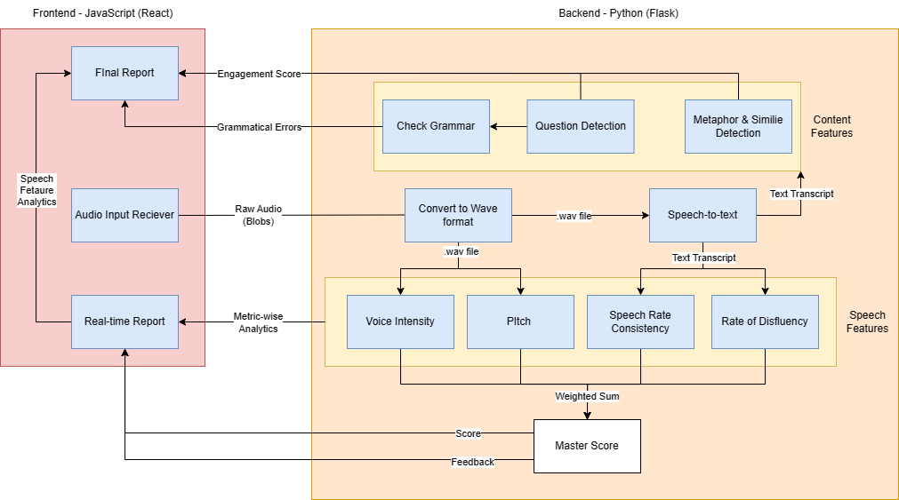

# Real-Time Speech Improvement Web Application

## Overview

Fluent and coherent speech is a necessary skill to have, and it is an improvisable skill. Feedback is a vital component for getting better at it. However, public speaking is a common fear, affecting many people worldwide. Practicing alone without assistance can be isolating and lacks real-time feedback. Our web application provides real-time analysis of ongoing speech by utilizing various speech evaluation techniques along with Natural Language Processing.

### Features Evaluated:
- **Voice Input:** Pitch and Intensity
- **Speech Delivery Technique:** Fluency and Consistency
- **Content of the Speech:** Grammatical accuracy, metaphor detection, and more

## Architecture

The system consists of a React.js frontend that captures audio input and sends it to the backend, which is implemented using Flask. The speech is converted to text using Assembly AI's STT API, and the transcript is processed to evaluate various features.

## Team

This project was developed during a hackathon where it was shortlisted among the top teams to the final round.

### Team Members

- [Rohan Jamakhandi](https://github.com/rohan-jamakhandi)
- [Sathvik Malgikar](https://github.com/Sathvik-Malgikar/)
- [Sadhika Rao](https://github.com/Sadhika1012)
- [Shreeya Rao](https://github.com/Shreeyasatish)
